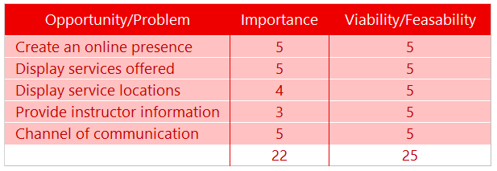
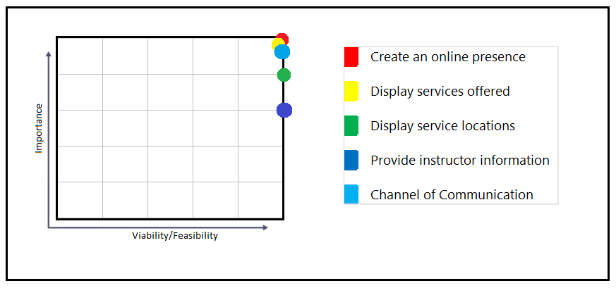
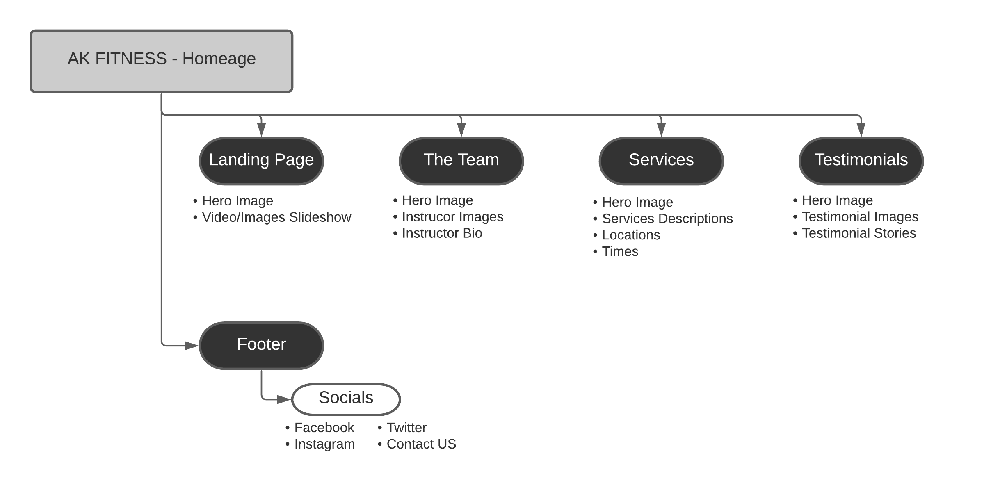
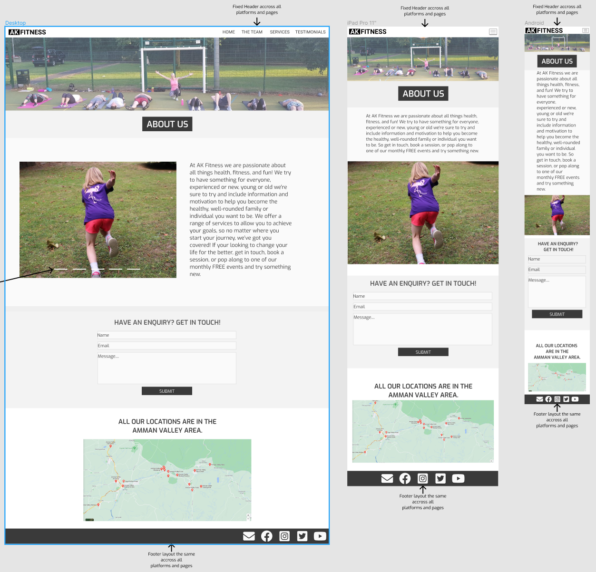
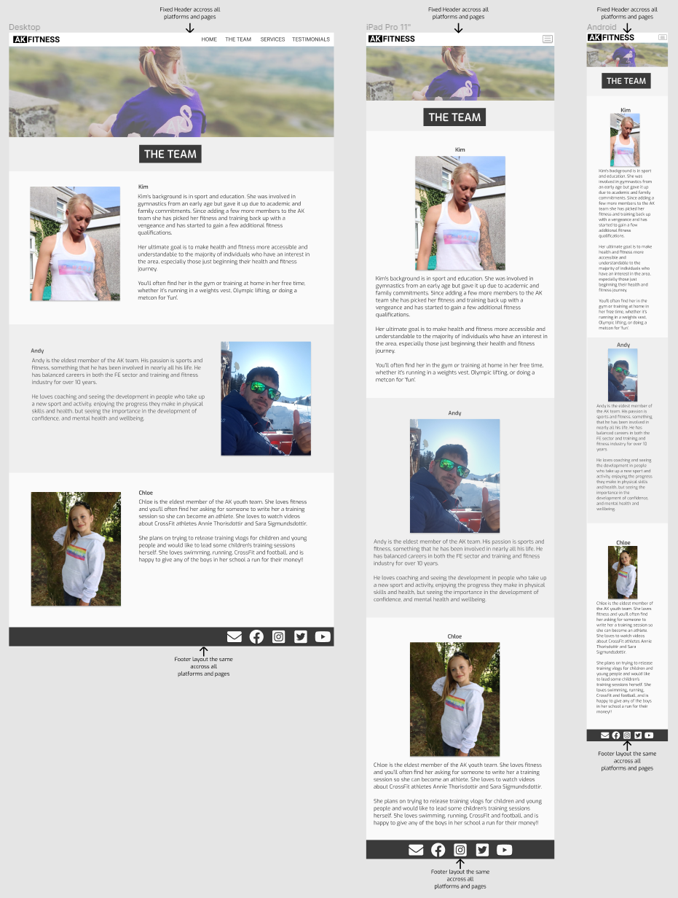
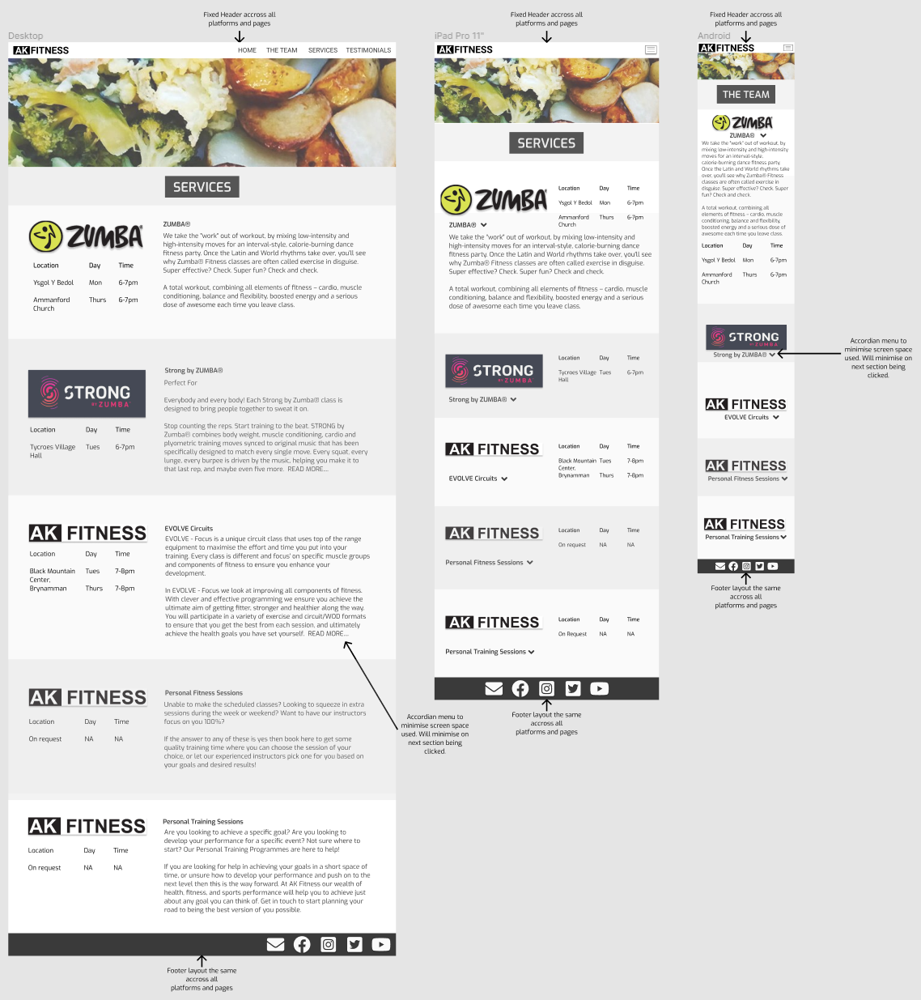
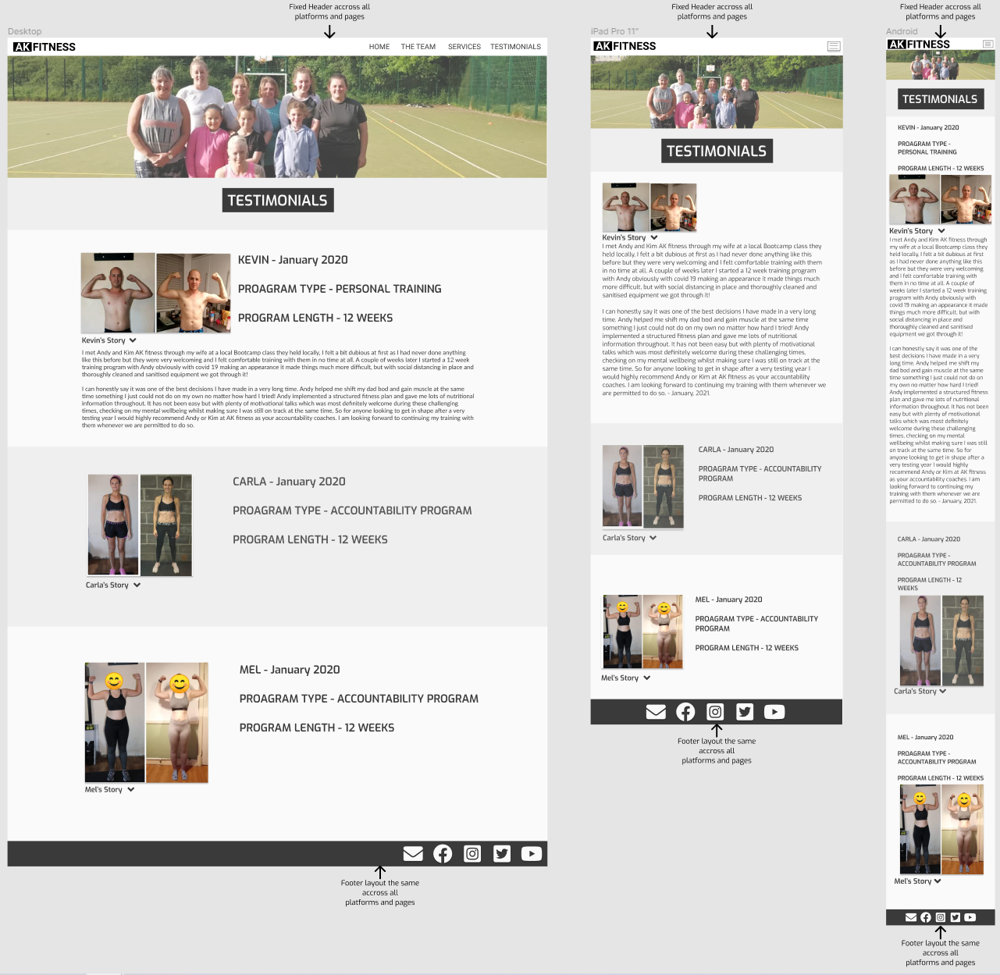

# AK FITNESS

.....................................................PLACE LIVE SITE MOCKUP IMAGES HERE (EMBED AS PNG)...................................................

## Table of contents
1. [Introduction](#Introduction)
2. [UX](#UX)
    1. [User Demographic](#User-Demographic)
    2. [User Stories](#User-Stories)
    3. [Development Planes](#Development-Planes)
    4. [Design](#Design)
3. [Features](#Features)
    1. [Design Features](#Design-Features) 
    2. [Existing Features](#Existing-Features)
    3. [Features to Implement in the future](#Features-to-Implement-in-the-future)
4. [Issues and Debugging](#Issues-and-Debugging)
5. [Technologies Used](#Technologies-Used)
     1. [Main Languages Used](#Main-Languages-Used)
     2. [Additional Languages Used](#Additional-Languages-Used)
     3. [Frameworks, Libraries & Programs Used](#Frameworks,-Libraries-&-Programs-Used)
6. [Testing](#Testing)
     1. [Testing.md](TESTING.md)
7. [Deployment](#Deployment)
     1. [Deploying on GitHub Pages](#Deploying-on-GitHub-Pages)
     2. [Forking the Repository](#Forking-the-Repository)
     3. [Creating a Clone](#Creating-a-Clone)
8. [Credits](#Credits)
     1. [Content](#Content)
     2. [Media](#Media)
     3. [Code](#Code)
9. [Acknowledgements](#Acknowledgements)
***

## Introduction

This website was designed for AK FITNESS, a local fitness company based in south Wales. The focus of the site is to create an online presence for the company, allowing existing and new clientele to gather relevant information regarding the company and the services they offer.

AK FITNESS is a small fitness company with a core focus on fitness in the community, encouraging physical and mental well-being. They have operated for several years and have expanded the area in which classes and services are delivered, whilst continuing to develop the range of services they provide. The purpose of the site was to allow potential and existing clientele to identify locations where services are delivered, the type of services offered, and provide a method of opening direct communication with the company for enquiries.

As the first of four Milestone Projects that must be completed in order to complete the Diploma in Web Application Development, the main requirements were to ensure that the website developed incorporated **HTML5** and **CSS3** to create a responsive and static website across a minimum of three pages.

## UX

### User Demographics
#### Users of this website are:
- Potential customers
- Current customers
- Returning customers

### User Stories
#### New/Potential Customers Goals:
1. As a new/potential customer I want to easily navigate through the website to find the relevant class and location information.
2. As a new/potential customer I want to learn more about the company's/staff background in order to better understand AK FITNESS and their industry experience.
3. As a new/potential customer I want to easily navigate to the company's social links in order to keep up with the latest news and offers.
4. As a new/potential customer want to be able to find visual representation of the types of services they offer and user experiences.
5. As a new/potential customer I want to easily contact the company in order to discuss potential bookings for services.

#### Returning/Current Customers Goals:
1. As a current customer I want to navigate to information about upcoming services and locations.
2. As a current customer I want to find out about new and upcoming offers or special events that the company is running.
3. As a current customer I want to easily contact the company in order to discuss existing or potential bookings for services.

### Development Planes

In order to create a website that served both the needs of the user and the needs of the company the developer worked closely with AK FITNESS to ensure that all phases of development would relate to customer and company goals.

#### Strategy
Strategy has been compartmentalised into three categories, with development focusing on the following target audiences:
- **Roles:**
     - New/Potential Customers
     - Returning/Current Customers
     - Local Health and Fitness Enthusiasts

- **Demographic:**
     - 12 - 70-year-olds
     - All Gender Identities
     - Health and Fitness Enthusiasts

- **Psychographics:**
     - Personality & Attitudes:
          - Youthful
          - Committed
          - Hard-working
     - Values:
          - Supporting local communities
          - Exercise for mental health and well-being
     - Lifestyles:
          - Active
          - Interested in health and fitness

The website needs to enable the **user** to:
- Retrieve desired information:
     - Instructor information
     - New services and locations
     - Upcoming offers and special events
     - Contact information (General or booking enquires)

The website needs to enable the **company** to:
- Develop an online presence 
- Provide an easily navigable website for customers to find relevant information:
     - Services offered
     - Service locations
     - Instructor information
- Provide a channel of communication for general and booking enquires (Contact Us form)
- Provide a channel of communication for new and current customers looking to remain up-to-date with current and new offers (Social Media Links - accessible throughout the site)

Using the above goal setting, a strategy table was created to determine the importance and viability trade-off with the following results:

#### Scope
A scope was defined in order to clearly identify what needed to be done in order to align features with the strategy previously defined. This was broken into two categories:
- **Content Requirements**
     - The user will be looking for:
          - Services information
          - Instructor information
          - Upcoming offers or events
          - Contact details
          - Social Links
          - 
- **Functionality Requirements**
     - The user will be able to:
          - Navigate the site in an intuitative manner in order to find the desired information
          - Using their desired method, easily contact the company for enquiries
#### Structure
The site architecture was structured in a **hierarchial tree structure** to ensure intuitive and efficiencient site navigation, with the following results: 

#### Skeleton 
[Figma Workspace](https://www.figma.com/file/j7ljqwRtZCtjavnE8sQTIP/AK-FITNESS?node-id=6%3A19) was used to create wireframe mockups for each page. This was done to ensure completer planning for a responsive design and ensure positive user experience:

Home Page:

The Team Page:

Services Page:

Testimonials Page:

## Features

## Issues and Debugging

## Technologies Used

## Testing

Testing information can be found in the separate testing [file] (Testing.md "Link to testing file")

## Deployment

## Credits

## Acknowledgements

...............................REMEMBER TO PUT BACK TO TOP LINK AT THE BOTTOM OF EACH PAGE.................................

[Back to top ⇧](#AK-Fitness)
